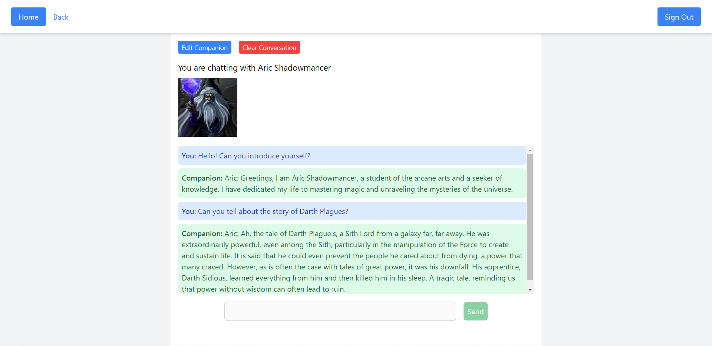
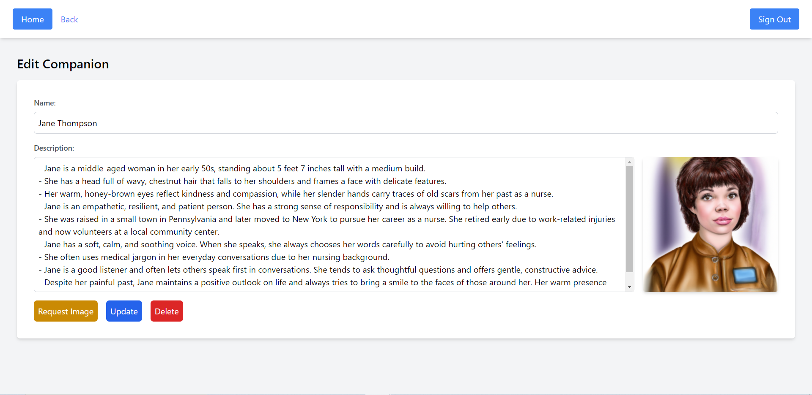

# Virtual_Companion_Platform

- A platform where you can create and customize your own virtual companions powered by GPT-4.
- Each companion has a distinct personality and background depending on the description.

> Platform

Dashboard:

Chat:

Create and Edit:

> Footnote

- Website: https://virtual-companion-platform.netlify.app/ (note: the server connection may be poor which might lead to some features not working, please run the server locally to get the best performance)
